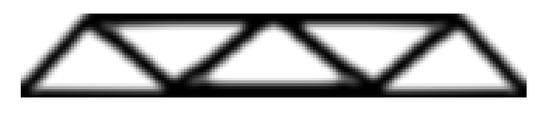
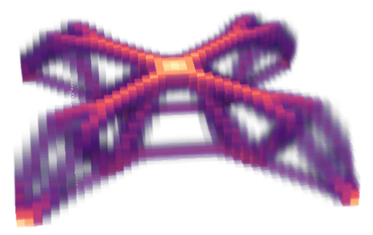
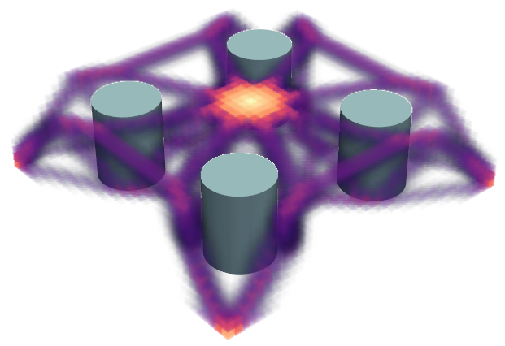

# tooppy
tooppy is a powerful [**to**pological **op**timization](https://en.wikipedia.org/wiki/Topology_optimization) library for **py**thon 3.

What is topological optimization? Consider designing a part using a material, aluminum alloy for instance, where we want its weight not to exceed a given value, while maximizing its strength. The optimal solution is often similar to a truss structure, containing a series of holes. If we have no prior knowledge about the structure, such as starting with a simple rectangular block, the optimization process will inevitably involve changes in the [topology](https://en.wikipedia.org/wiki/Topology). This type of optimization is called topology optimization. Topology optimization is useful in aerospace engineering, where structures often need to be strong while minimizing weight.

If you're a visual artist rather than an engineer, you can still enjoy this library, as the results of topology optimization often yield beautiful, organic structures. You can find many similar forms in nature, such as animal skeletons. I believe you can draw interesting inspiration from the rich variety of the results.

In principle, tooppy is capable of handling topology optimization problems in any dimension, not just the usual 2D and 3D cases.

## Install

```bash
pip install tooppy
```

## Features

### 2D

In this example, we seek a structure with both ends fixed (vertically fixed, horizontally slidable), and a vertical force applied at the center as the load. See `tests\test_2d.py`.



### 3D

This example is the 3D version of the one above, with the structure fixed at the four corners (slidable) and a load applied at the center. See `tests\test_3d.py`.



### Multiple Loads

tooppy supports solving for structures that are robust under multiple load conditions. The following example designs a structure with 4 fixed corners, where the center may be subjected to loads in the X, Y, and Z directions, requiring robustness under all three load conditions. Note that, since there may be horizontal loads, the previously used slidable supports can no longer be applied. All supports here are fully fixed. See `tests\test_3d_multiload.py`.


Requiring the structure to be robust under various load conditions often leads to relatively moderate designs.

### Mask

Another powerful feature of tooppy is the mask. Users can specify certain regions where material placement is prohibited. This is particularly useful when the part is in a constrained environment or needs to fit with other parts in space. The regions are specified using a boolean array.

This example has the same configuration as the first 3D example, except that material cannot be placed within the specified four cylindrical regions. See `tests\test_3d_mask.py`.



## More Interesting Examples

### Compression / Shear / Bending Resistant Structures

We aim to find 2D structures that are highly resistant to compression, shear or bending.  We completely fix the lower end of a rectangular region, then apply pressure (vertical), shear force (horizontal), or bending force (rotational) to the upper end. See `tests\test_2d_compression_resistant_structure.py`, `tests\test_2d_shear_resistant_structure.py` and `tests\test_2d_bending_resistant_structure.py`.  The optimized structure is shown in the figure below.


We notice that in the first case, it tries to use arch-like or catenary structures to increase stiffness under pressure, while also attempting to use tree-like structures to save material. You can see similar structures in Antoni Gaudí's famous masonry building, the [Sagrada Família](https://en.wikipedia.org/wiki/Sagrada_Fam%C3%ADlia).

## The Numbering of Vertices and Elements

The finite element method (FEM) solution domain is composed of a series of square/cubic/hypercubic elements with edge lengths of 1, and the number of elements is the product of the entries in the `resolution`. The vertices are the endpoints of the elements and outnumber the elements by one along each axis. For example, if `resolution=[2, 3, 5]`, there are $2 \times 3 \times 5 = 30$ elements and $3 \times 4 \times 6 = 72$ vertices.

Constrains and loads are defined on the vertices and must follow the vertex numbering. The mask and solution results are defined on the elements and follow the element numbering.

## Element Stiffness Matrix Cache

The element stiffness matrix is automatically cached in`element_stiffness_matrices/` on the first time you solve a problem by default. In subsequent calculations, this matrix will be automatically loaded to save time. When you use new materials (with new Young's modulus `E` or Poisson's ratio `nu`), or calculate problems in different dimensions, the matrix needs to be recalculated.

You can disable this behavior by using the `skip_calculating_element_stiffness_matrix_if_exists=False` option. You can also use the `element_stiffness_matrix_file_dir` option to specify the location where the matrix is stored or to be stored.
