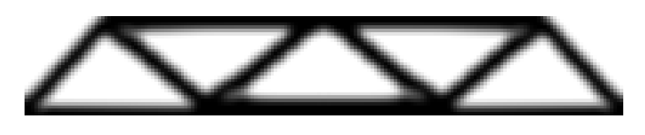
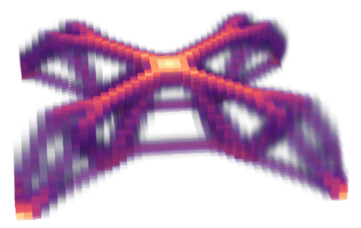
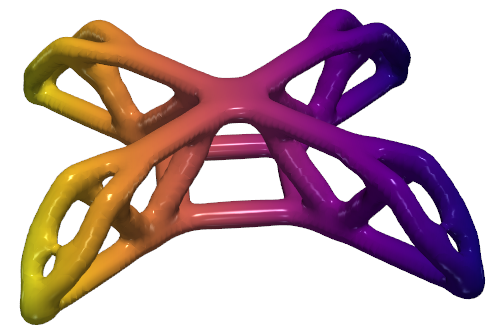
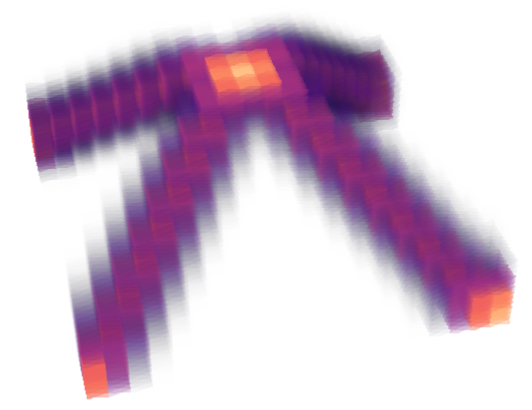
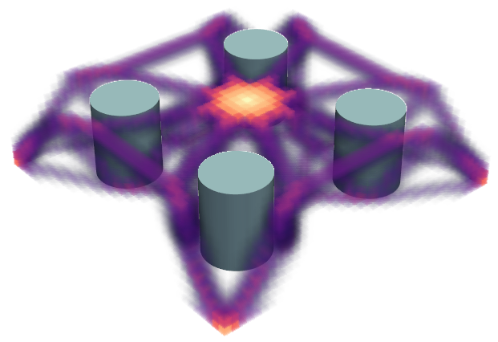
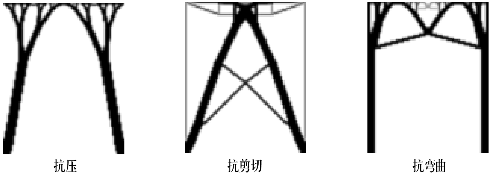
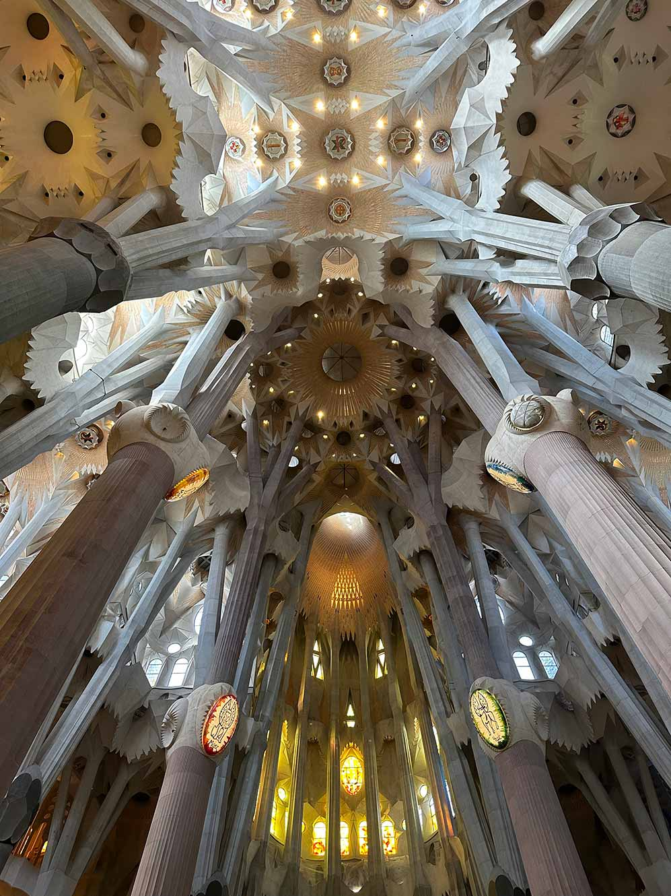

# tooppy

[English version](README.md)

tooppy（**to**pological **op**timization for **py**thon 3）是一个功能强大的用于[拓扑优化](https://baike.baidu.com/item/%E6%8B%93%E6%89%91%E4%BC%98%E5%8C%96)的python 3包。

什么是拓扑优化？考虑使用某种材料，比如铝合金，设计一个零件，我们希望它重量不超过某个给定的值，同时强度尽可能大。最优解通常类似桁架结构，这意味着其包含一系列孔洞。如果一开始对结构一无所知，比如说从最简单的长方体开始，那这个优化过程必然涉及[拓扑](https://baike.baidu.com/item/%E6%8B%93%E6%89%91)结构的改变。这种优化被称为拓扑优化。拓扑优化在航天工程中有用，因为这类工程中经常需要结构坚固，同时尽可能减重。

如果你是视觉艺术家而不是工程师，你也可以享受这个库，因为拓扑优化的结果经常是一些精美、有机的结构。你在自然中能找到很多类似的结构，如动物的骨骼。我相信你能从丰富的结果中获得有趣的灵感。

原则上，tooppy能胜任任意维度的拓扑优化问题，而不只是通常的2维和3维。

## 安装

```bash
pip install tooppy
```

## 特性

### 2D

在此算例中，我们寻找一个结构，在两端固定（竖直方向固定，水平方向可滑动），中间设置竖直方向的外力作为负载。见`tests\test_2d.py`。



### 3D

此算例是上面2D算例的三维版本，结构在四个角固定（可滑动），中间加负载。见`tests\test_3d.py`。



你可以将三维数组转化为网格并导出为STL文件。见`tests\conver_to_mesh.py`。



tooppy提供了用于计算网格**体积**、**质心**以及**惯性张量**的方法。详见tests/get_geometric_information.py`。

### 多种负载

tooppy支持求解在多种受力状态下都坚固的结构。以下例子设计一个结构，在四个角固定，中间可能承受X、Y、Z三种方向的负载，要求在三种负载下都坚固。注意，此处因为可能有水平方向的负载，不能再使用之前的可滑动的支撑。这里的支撑全部是完全固定的。这里所有的支撑都是完全固定的。见`tests\test_3d_multiload.py`。



要求结构在多种受力状态下都坚固，经常会导致相对中庸的设计。

### 遮罩

tooppy另一个强大的特性是mask。用户可以指定一些区域，禁止在那里放置材料。这对零件所在环境空间有限，或需要与其他零件在空间中相互配合的情况非常有用。区域是通过一个布尔数组指定的。

这个例子与3D的第一个例子配置相同，只不过要求不能在指定的4个圆柱体区域内放置材料。见`tests\test_3d_mask.py`。



## 更多有趣的例子

### 抗压/剪切/弯曲结构

我们尝试寻找分别对压、剪切、弯折有强抗性的二维结构。我们完全固定一个矩形区域的下端，然后在上端施加压力（纵向）、剪力（横向）或弯曲力（旋转）。见`tests\test_2d_compression_resistant_structure.py`、`tests\test_2d_shear_resistant_structure.py`和`tests\test_2d_bending_resistant_structure.py`。优化得到的结构见下图。



在第一幅子图中，我们注意到其尝试用拱形或悬链线形结构来增大压力下的刚性，同时尝试使用树状结构节省材料。你可以在安东尼奥·高迪的著名砌体建筑[圣家族大教堂](https://baike.baidu.com/item/%E5%9C%A3%E5%AE%B6%E6%97%8F%E5%A4%A7%E6%95%99%E5%A0%82)中见到类似结构。见下图。



## 点和元素的编号

要求解问题，你需要构造的用于设定约束、负载、mask的函数`get_fixed`、`get_load`和`get_mask`中的一个或多个。在这些函数中你需要返回一个数组来告知程序哪些自由度是被固定的、哪些顶点在什么方向上受外力、哪些元素必须空出来，不允许放置材料。

关于顶点和有限元元素的编号，有限元求解区域由一系列边长为1的正方形/正方体/超立方体元素构成，元素的数量为resolution中各项的乘积。而顶点是元素的端点，其在每个轴都比元素多一个。例如，若resolution=[2, 3, 4]，元素有2*3*6=36个，顶点有3*4*7=84个。

支撑和负载是定义在顶点上的，必须遵从顶点的编号。而mask以及求解结果是定义在元素上的，遵从元素的编号。

通常而言你不用花费太多注意力在编号上。`get_fixed`和`get_load`都接受`resolution`、`ndof`、`coordinates`三个参数，`get_mask`接受`resolution`、`number_of_cells`、`coordinates`三个参数，多数情况下你可以使用这些信息轻松地构造出你想要地约束、负载和mask。一种典型方法是使用`coordinates`构造一个布尔数组来选择操纵NumPy数组的哪些项，例子见`tests\test_3d_mask.py`。

当你需要求解区域（矩形、长方体或超长方体）的顶点、边、面等上面的点的编号时，你可以使用`tooppy.get_indices_on_boundary_elements(resolution, axis_selection)`轻松办到。比如你想在$5 \times 5$的点阵中选择最靠左的一列，你可以写`tooppy.get_indices_on_boundary_elements([5, 5], [[True, False], None])`。`[[True, False], None]`表示在第一个轴上选则起点而不选择终点，在第二个轴上全选。如果你想选一个长方体朝向Y正向和反向的那2个面，你的`axis_selection`需要写`[None, [True, True], None]`。如果你想要长方体Z方向的4条边，你会写`[[True, True], [True, True], None]`。

注意，因为`get_fixed`、`get_load`和`get_maskresolution`传进来的`resolution`是元素阵列的尺寸，当你试图获得顶点的编号而不是元素的编号时，即你编写`get_fixed`、`get_load`的内容时，你必须手动给`resolution`的每一项加一再传入`get_indices_on_boundary_elements`。

## 元素刚性矩阵缓存

默认情况下，当你第一次求解问题时，元素刚性矩阵会自动缓存在`element_stiffness_matrices/`.。在之后的计算中，这个矩阵会被自动加载以节省时间。当你使用新的材料（新的[杨氏模量](https://baike.baidu.com/item/%E6%9D%A8%E6%B0%8F%E6%A8%A1%E9%87%8F)`E`或[泊松比](https://baike.baidu.com/item/%E6%B3%8A%E6%9D%BE%E6%AF%94)`nu`），或计算不同维数的问题，需要重新计算这个矩阵。你可以使用`skip_calculating_element_stiffness_matrix_if_exists=False`选项来禁止这一行为。你也可以使用`element_stiffness_matrix_file_dir`选项来设置矩阵的存放位置。

## 下一步的工作

1. 根据几何元素（线段、圆等）生成点编号
2. 在README中添加关于`tooppy.get_indices_on_boundary_elements`的例子
3. 生成动画

## 引用

此项目在开发过程中参考了如下项目和代码：

1. [ToPy](https://github.com/williamhunter/topy)
2. [topopt2D](https://github.com/worbit/topopt2D/tree/master)

圣家族大教堂的照片由郑章琴提供。
